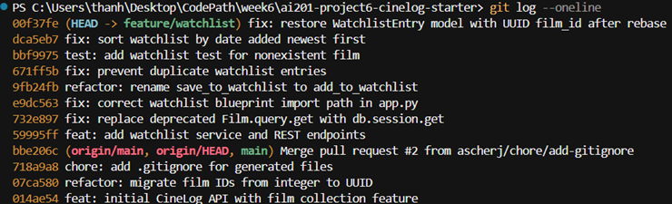

# PR Response Doc — CineLog Watchlist Feature

## AI Usage

I used Cursor (AI-assisted coding) at several points during this project, always as a helper rather than a substitute for my own review.

**Codebase orientation:** Before touching the watchlist code, I asked the AI to read `models.py`, `services/collection_service.py`, and `tests/test_collection.py` and walk me through naming conventions, deduplication handling, and test structure. That gave me a clear template to follow when implementing `add_to_watchlist()` and `tests/test_watchlist.py` — especially the pattern of querying for an existing entry before insert and raising a custom exception.

**Review comment triage:** I asked the AI to pull all six maintainer comments from the GitHub PR and categorize what each one required (code change, written response, or decision) before I started work. That helped me plan the order: code fixes first, design arguments next, rebase last.

**Commit format verification:** After finishing the implementation, I pasted my `git log` and asked whether the messages followed Conventional Commits and whether any commits bundled multiple logical changes. The AI flagged `612a122` (no type prefix, vague message) and `377a318` (import fix bundled with `db.session.get` migration). I used an interactive rebase to split and rewrite those commits before pushing.

**Comment 4 and Comment 5 responses:** For both design-decision comments, I told the AI my positions — keep `public=True`, adopt date-added sort order — and asked it to draft written arguments that acknowledged tradeoffs and engaged with the maintainer's reasoning. The AI returned drafts emphasizing community discovery (Comment 4) and recency-over-alphabetical consistency with `get_collection()` (Comment 5). My final responses in this doc keep those core arguments; I reviewed them to make sure they reflected decisions I actually made in the code (the `public` column default in `WatchlistEntry` and the `.order_by(WatchlistEntry.date_added.desc())` change in `get_watchlist()`), not generic filler.

I verified all AI-suggested code changes by running `pytest tests/ -v` after each commit and by manually searching the repo for missed call sites (e.g., `save_to_watchlist` references).

---

## Comment 1 — Rename

**What I did:** Renamed `save_to_watchlist()` to `add_to_watchlist()` in `services/watchlist_service.py` and updated the function docstring to say "Add" instead of "Save."

**Where I looked for call sites:** I ran a project-wide search for `save_to_watchlist` across the entire repository. That turned up exactly two files beyond the service definition itself:

- `services/watchlist_service.py` — the function definition
- `routes/watchlist/watchlist.py` — the import on line 8 and the call on line 32

I updated both the import (`from services.watchlist_service import add_to_watchlist, get_watchlist`) and the call site (`add_to_watchlist(user_id=user_id, film_id=data["film_id"])`). After the changes, I ran the search again and confirmed zero remaining references to `save_to_watchlist`.

**How I verified:** Ran `pytest tests/ -v` — all 4 existing collection tests passed with no regressions.

**Commit:** `refactor: rename save_to_watchlist to add_to_watchlist`

---

## Comment 2 — Deduplication

**What I did:** Added deduplication logic to `add_to_watchlist()` following the same pattern as `add_to_collection()` in `services/collection_service.py`.

**The pattern I followed:**

1. Defined a custom exception class — `AlreadyOnWatchlistError` — mirroring `AlreadyInCollectionError` in the collection service.
2. After confirming the film exists, query for an existing entry with `WatchlistEntry.query.filter_by(user_id=user_id, film_id=film_id).first()`.
3. If a match is found, raise `AlreadyOnWatchlistError` with a descriptive message instead of creating a duplicate row.
4. Updated the function docstring to document the new `Raises` clause.

**How I verified the logic works:** The implementation mirrors `add_to_collection()` line-for-line (existence check → duplicate check → create entry → commit). I confirmed the collection service's duplicate test (`test_add_to_collection_duplicate_raises`) still passes, which validates the reference pattern is sound. Ran `pytest tests/ -v` after the change — all tests still pass.

**Commit:** `fix: prevent duplicate watchlist entries`

---

## Comment 3 — Missing test

**What I did:** Created `tests/test_watchlist.py` with a test for the nonexistent-film case.

**Model test I used:** `test_add_to_collection_nonexistent_film_raises` in `tests/test_collection.py` (lines 98–107). I replicated its structure:

- Same fixture setup (`app`, `sample_user`) with identical in-memory SQLite configuration
- Same test pattern: enter `app.app_context()`, use a fake `film_id` of `"00000000-0000-0000-0000-000000000000"`, assert `pytest.raises(FilmNotFoundError)` when calling the add function
- Same section comment style (`# ── Nonexistent film ──`)

**How I verified:** Ran `pytest tests/test_watchlist.py -v` — the new test passed. Then ran the full suite with `pytest tests/ -v` — all 5 tests passed (4 collection + 1 watchlist).

**Commit:** `test: add watchlist test for nonexistent film`

---

## Comment 4 — Default visibility

**My position:** I am keeping `public=True` as the default for new watchlist entries.

**What user behavior I'm optimizing for:** CineLog is described as a *community* film tracking app — users log what they've watched, rate films, and build collections they share with others. A watchlist is the natural "what I want to watch next" signal, and making that visible by default supports the core social loop: friends and other users can discover films through each other's lists, start conversations ("I loved that one — bump it up your queue"), and find recommendations from people with similar taste. Defaulting to public lowers the friction for that discovery — users don't have to opt in to participate in the community aspect of the product.

**Tradeoff acknowledged:** The alternative — defaulting to `public=False` — better protects users who treat their watchlist as private planning (films they aren't ready to share, guilty-pleasure picks, gifts they don't want spoiled). A private-by-default model follows a privacy-first posture and avoids surprising users who assumed their list was personal. I weighed this against CineLog's stated community focus and concluded that for *this* product, discoverability is the primary goal. If we see user feedback that people want more privacy, a per-user default preference (or a prompt on first watchlist add) would be the right follow-up without changing the API contract.

**Code change:** None required — this is a documented design decision. The `public` column default remains `True` in `WatchlistEntry`.

---

## Comment 5 — Sort order

**My position:** I changed `get_watchlist()` to sort by `date_added` descending (newest first), matching `get_collection()`.

**Engaging with the maintainer's reasoning:** The reviewer argued that most users want to see what they added recently, not an alphabetical list — and I agree. A watchlist is a living queue: the film you saved five minutes ago is more actionable than one you saved six months ago and may have already seen elsewhere. Alphabetical order is useful for lookup ("where is *Blade Runner* in my list?") but that's a secondary use case compared to "what did I just add?" Recency-first also keeps watchlist behavior consistent with collection, so users don't have to learn two different mental models for two similar features.

**Why I didn't keep alphabetical or propose a third option:** A user-selectable sort (date vs. title vs. priority) would be ideal long-term, but it adds API surface area we don't need yet. Alphabetical is predictable but buries recent additions — the exact problem the reviewer identified. Date-added descending is the simplest change that aligns with both the reviewer's preference and existing collection behavior.

**What I implemented:** Updated `get_watchlist()` in `services/watchlist_service.py` to use `.order_by(WatchlistEntry.date_added.desc())` instead of `.join(Film).order_by(Film.title.asc())`. Removed the unnecessary `Film` join since sorting is on the entry's own timestamp.

**Commit:** `fix: sort watchlist by date added newest first`

---

## Comment 6 — Rebase

**What I did:** Fetched `origin` and rebased `feature/watchlist` onto `origin/main` with `git rebase origin/main`.

**What conflicted:** The rebase itself applied all six branch commits cleanly with no interactive conflict markers. However, after the rebase I discovered a functional gap: the rebased `models.py` from `main` no longer contained the `WatchlistEntry` model. The original watchlist work had `WatchlistEntry` with `film_id` as an `Integer` in an older version of `models.py`, but the initial watchlist commit on this branch only touched `app.py`, `routes/watchlist/watchlist.py`, and `services/watchlist_service.py` — not `models.py`. Once `main`'s UUID-migrated `models.py` became the base, `WatchlistEntry` was missing entirely and tests failed with `ImportError: cannot import name 'WatchlistEntry'`.

**How I resolved it:**

1. Re-added `WatchlistEntry` to `models.py` with `film_id` as `db.String(36)` (UUID), matching `Film.id` and `CollectionEntry.film_id` on `main`.
2. Added an explicit `film = db.relationship("Film", foreign_keys=[film_id])` on `WatchlistEntry` so `entry.film.to_dict()` works in `get_watchlist()` without conflicting with `CollectionEntry`'s existing `backref="film"`.
3. Updated stale integer-ID references in `services/watchlist_service.py` docstring (`film_id (str): UUID of the film`) and `routes/watchlist/watchlist.py` endpoint docstring (`"film_id": "<uuid>"`).

**How I confirmed the conflict was fully addressed:**

- `pytest tests/ -v` — all 5 tests pass (4 collection + 1 watchlist), including `test_add_to_watchlist_nonexistent_film_raises` which uses a UUID-shaped fake ID.
- `git log origin/main..HEAD --merges` — empty output, confirming no merge commits were introduced on the feature branch (linear history per `CONTRIBUTING.md`).
- Grep for integer film ID references in watchlist code — none remain; `WatchlistEntry.film_id`, service docstrings, and route docs all use UUID strings.

**Branch history after rebase:**



**Commit:** `fix: restore WatchlistEntry model with UUID film_id after rebase`

---

## PR Description

*(Copy this section into [PR #1](https://github.com/tquangdang/ai201-project6-cinelog-starter/pull/1) on GitHub — click the **Edit** button next to the title on the merged PR page.)*

### What this feature does

This PR adds a **watchlist** feature to CineLog. Users can save films they want to watch later, view their personal watchlist, and add films via REST endpoints. The implementation includes a `WatchlistEntry` model, service functions (`add_to_watchlist`, `get_watchlist`), and routes under `/watchlist/`. Adding a film checks that the film exists and prevents duplicate entries for the same user/film pair.

### Design decisions

1. **Visibility default (`public=True`):** New watchlist entries default to public. CineLog is a community film app, so making watchlists visible by default supports discovery — other users can see what someone plans to watch and find recommendations through shared lists. The tradeoff is reduced privacy for users who want a personal planning queue; a per-user privacy preference could be added later without changing the current API.

2. **Sort order (date added, newest first):** `get_watchlist()` returns films sorted by `date_added` descending, matching `get_collection()`. Most users care about what they added recently, not alphabetical order. Recency-first keeps the watchlist feeling like a living queue and consistent with how collections are displayed.

### Manual testing steps

1. **Install and start the server**
   ```bash
   pip install -r requirements.txt
   python app.py
   ```
   The app runs at `http://localhost:5000`.

2. **Get a user ID and film ID** (from your database or by creating records via the API/shell). You need a valid user UUID and film UUID.

3. **List available films** (to find a `film_id`)
   ```bash
   curl http://localhost:5000/films/
   ```

4. **Add a film to a user's watchlist**
   ```bash
   curl -X POST http://localhost:5000/watchlist/<user_id>/add \
     -H "Content-Type: application/json" \
     -d "{\"film_id\": \"<film-uuid>\"}"
   ```
   Expected: `201` response with the new `WatchlistEntry` JSON.

5. **View the user's watchlist**
   ```bash
   curl http://localhost:5000/watchlist/<user_id>
   ```
   Expected: JSON array of films, newest added first, each with `date_added` and `public` fields.

6. **Verify deduplication** — repeat step 4 with the same `film_id`. Expected: error (duplicate rejected, not a second entry).

7. **Run automated tests**
   ```bash
   pytest tests/ -v
   ```
   Expected: all tests pass (collection + watchlist).
